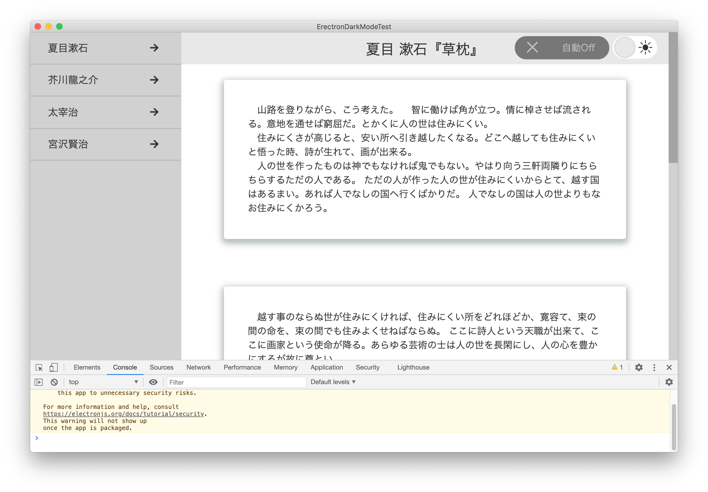
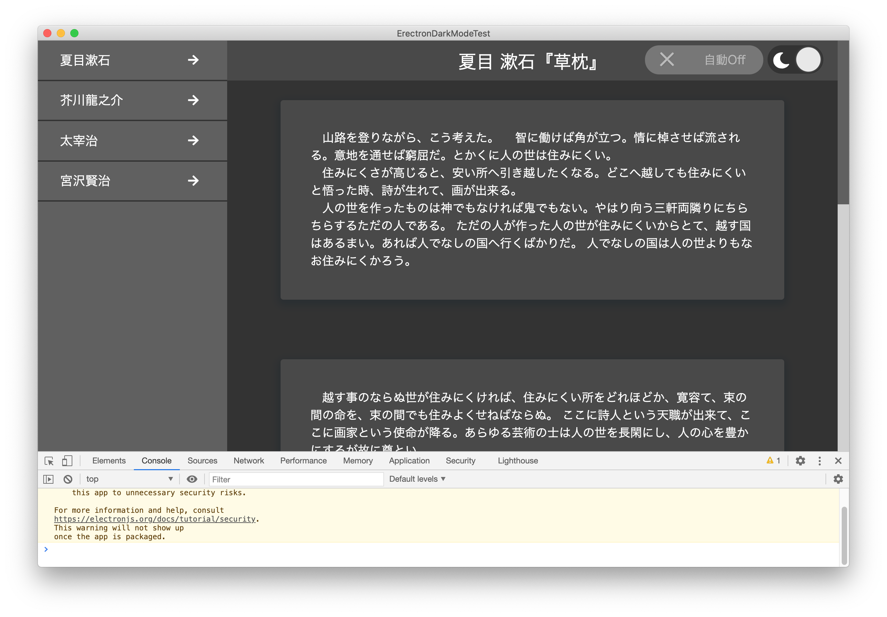

# Erectron-Dark-Mode-Test

Erectron で、ライト／ダークモード切り替えを実現したサンプルアプリケーションです。

ユーザー手動による切り替えはもちろん、「自動」に設定されていた場合、macOS の「設定」→「一般」→「外観」の設定変更イベントに対応し、リアルタイムに切り替えられるようにしてあります。

|ライトモード|ダークモード|
|---|---|
|||

参考にしたのは、このサイトです。  
<https://dev.to/ananyaneogi/create-a-dark-light-mode-switch-with-css-variables-34l8>

レイアウトは、これをベースに改良しています。

FLAT SIDE MENU NAVIGATION - CodePen  
<https://codepen.io/envoy47/pen/pOzmKa>

## インストール

`node_modules` は、アップロードされておりません。`pull` した後、カレントディレクトリーで、`npm install` とコマンドを入力し、インストールしてからビルドを行ってください。

## ビルド

`electron-packager` モジュールをインストールしており、付属の `package.json` の中のコマンドで、macOSアプリケーションとしてのビルドするコマンドが用意されています。ビルドする場合は、`npm run package-mac` を実行してみてください。

## 解説ページ

このサンプルアプリケーションについて解説したページは、以下に投稿しています。こちらを参考にしてください。

Electron で macOS のダークモード切替機能を実装する  
<https://qiita.com/hibara/items/e86150a961f5f3226b5c>

## 実行ファイル

わざわざビルドすることなく、すぐに実行ファイルで動作を確認したい方は、macOS でのビルドしかありませんが、こちらのページからダウンロードして試すことができます。

<https://github.com/hibara/Erectron-Dark-Mode-Test/releases/>

## ライセンス

MITライセンス

## お問い合わせ

基本的には無保証・サポートはありませんが、もし万が一、提案・要望などありましたら、Issues に追加いただくか、以下までご連絡ください。できる範囲で対応いたします。

Mituhiro Hibara
<mailto:m@hibara.org>
